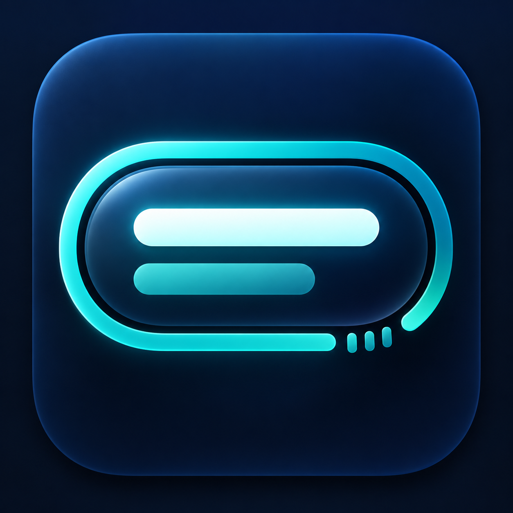

# Lyric Focus v2 / 歌词专注图标

Generated with built-in imagegen. Preview only; not installed or trademark-cleared.

Prompt: One refined macOS icon for Miorbi combining Dynamic Island, focus countdown and synced lyrics in one integrated mark. Midnight navy rounded-square tile; restrained cyan/turquoise dimensional material. Wide horizontal capsule approximately 1.7:1, framed by a partial rounded-rectangle progress arc with a lower-right break and three timer ticks. Inside, two bold rounded lyric strokes: longer bright white-cyan active line and shorter subdued teal line. Abstract lines, no words. Bold Dock-size silhouette. No circular ring with detached top bar, M, infinity loop, knot, flower, music note, busy equalizer, external brand, label or watermark.

