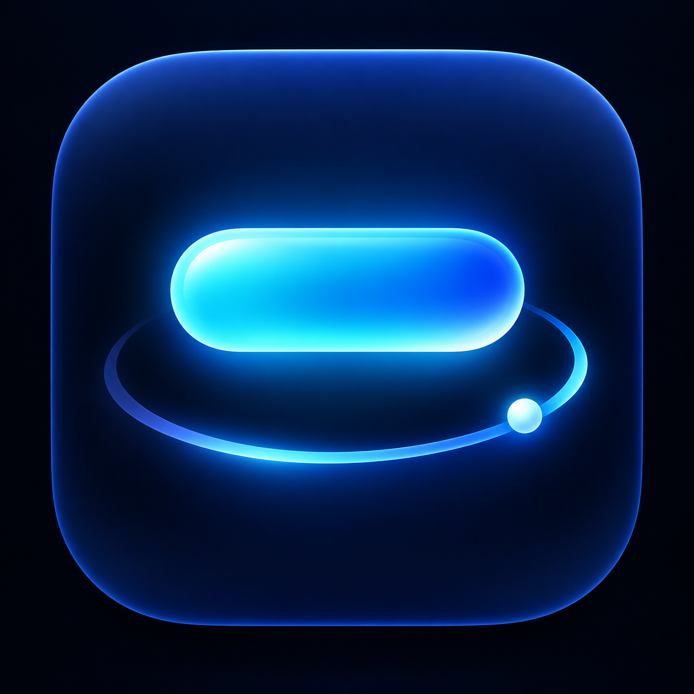
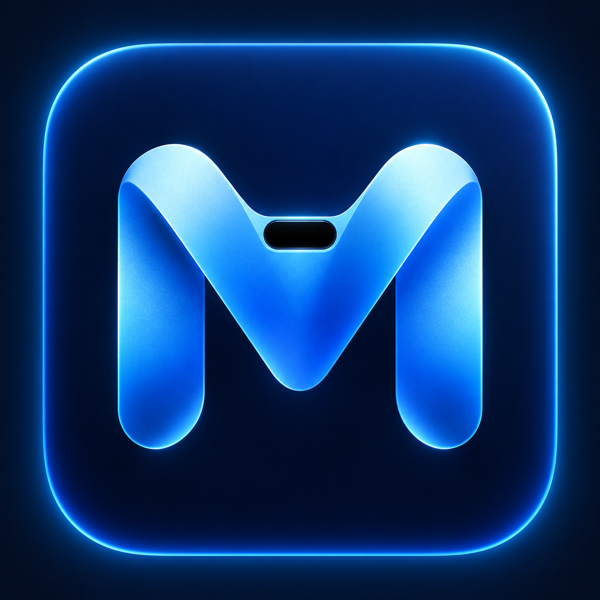
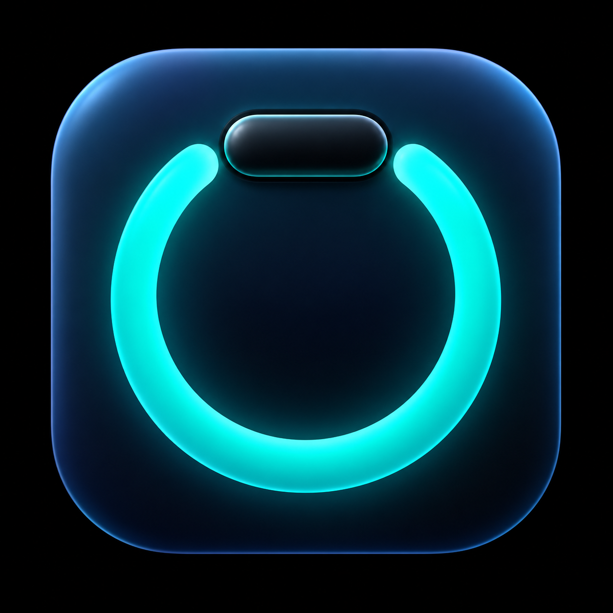
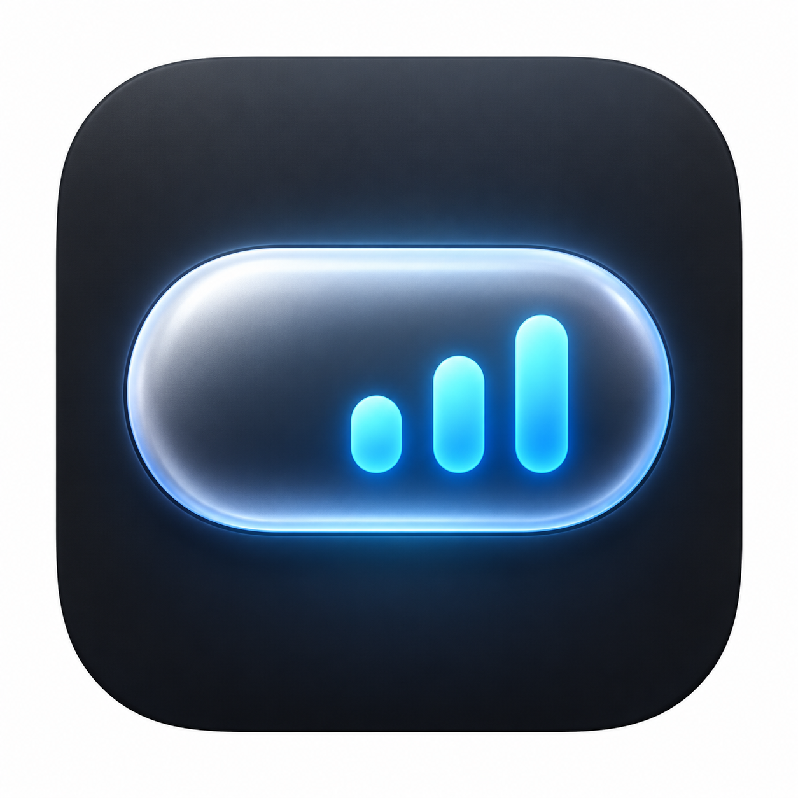
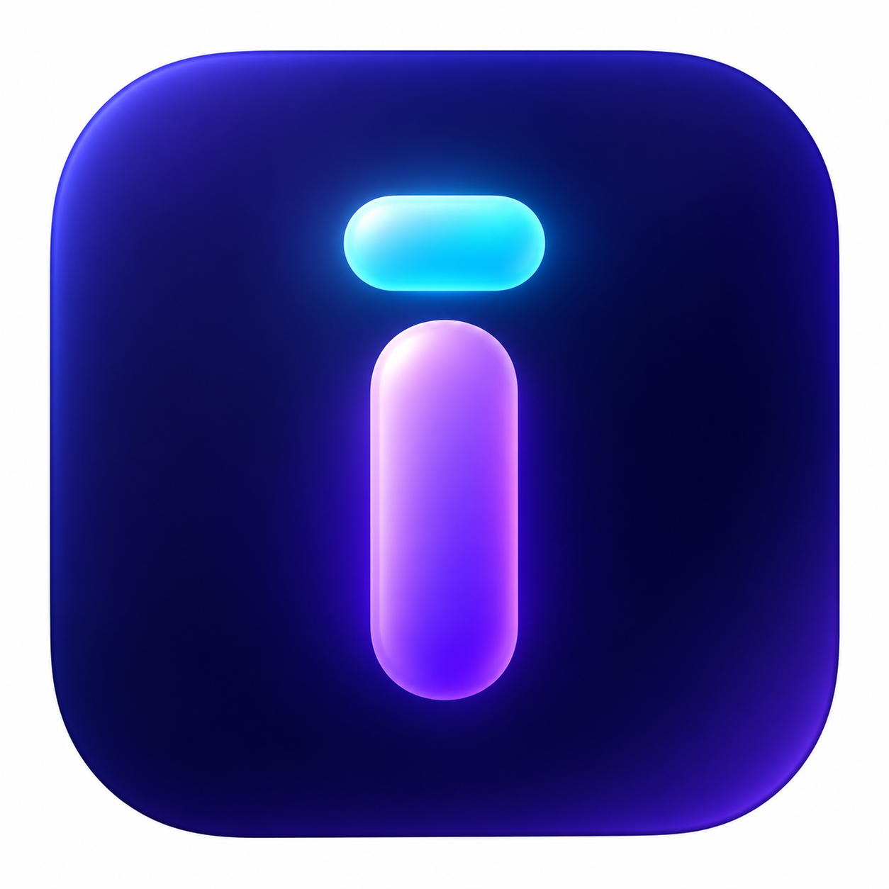

# Miorbi icon concepts / 图标候选

Five AI-generated branding explorations for selection, not the installed app icon. Built-in imagegen was used. No existing company mark was supplied as a generation reference. These are concept rasters; selected artwork will need final small-size tuning and transparent macOS icon export. No trademark clearance is claimed.

五个科技感方向，待选择，不会自动替换当前 App 图标。选定后再精修小尺寸和透明图标导出。

| 编号 | 方向 / Direction | 预览 / Preview |
|---|---|---|
| 1 | 灵动岛轨道 / Notch Orbit |  |
| 2 | M 字母 / M Monogram |  |
| 3 | 专注环 / Focus Portal |  |
| 4 | 活动胶囊 / Island Pulse |  |
| 5 | i 字母 / i Orbit |  |

## Prompt set

Common: one standalone macOS app icon for Miorbi, a notch/music/AI activity/focus companion; square front-on, centered, professional finished artwork, generous padding. No knot, flower, red interwoven symbol, China Unicom resemblance, extra UI, watermark, external brand, or text except requested monogram.

1. Midnight navy rounded-square, luminous cyan horizontal capsule over a simple open orbital arc and light point; premium futuristic depth.
2. Custom geometric M with soft metallic blue strokes and a tiny black notch capsule in its top center; navy tile, cyan edge light, no interlocking loops.
3. Thick incomplete turquoise focus ring with a compact black island capsule bridging the top opening; midnight tile, subtle bevels, simple silhouette.
4. Graphite rounded-square with a silver-blue horizontal pill containing three cyan ascending activity bars; restrained light, bold small-size shape.
5. Lowercase i formed by a luminous violet pillar and small cyan capsule dot; deep indigo tile, soft dimensional finish.
