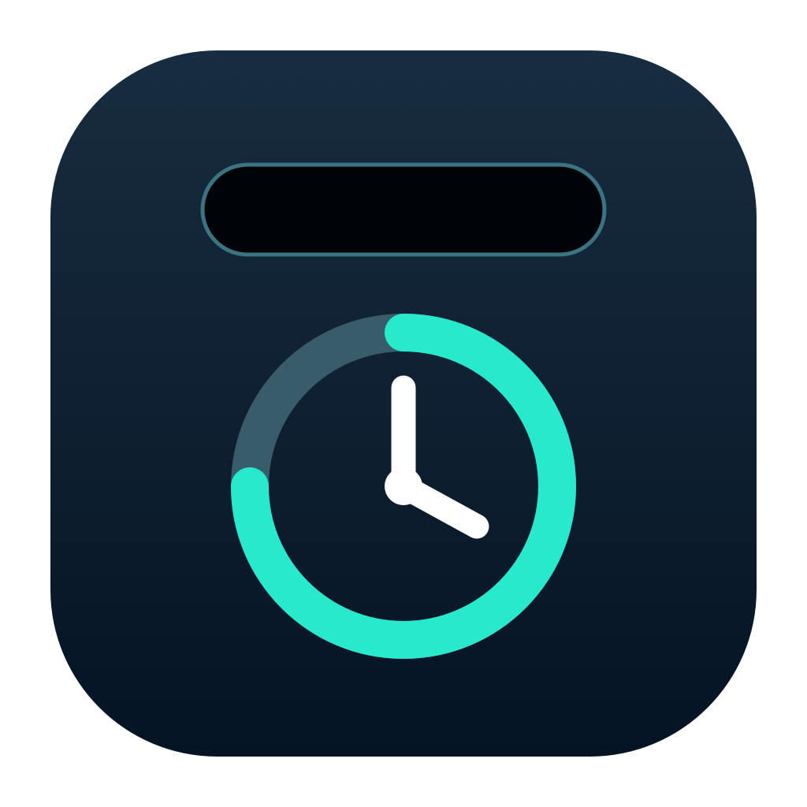

# Miorbi

[简体中文](#简体中文) · [English](#english)

## 简体中文

Miorbi 是一款为 macOS 刘海设计的轻量伴侣应用，把音乐、Codex 任务状态和专注计时放在同一处，让信息触手可及，让专注更有趣。

### 功能

- Apple Music：查看播放状态、控制上一首/播放暂停/下一首；同步歌词正在开发，只有取得可靠的当前行时才会显示，不会猜测歌词或把整页歌词误当成当前行。
- Codex：显示本机任务活动与审批提示；完成提示的去重和最终状态判定正在改进中。五小时和每周限额同步是可选功能。
- 专注时间：手动开启 15、25 或 60 分钟计时；满 15 分钟才计入累计。累计达到 25 分钟可兑换跳跃豆子，达到 250 分钟可兑换小牛；兑换不消耗累计时间。
- 设置与反馈：中英双语界面，可通过 GitHub Issues 报告 Bug 或建议功能。

### 隐私与权限

Codex 本地事件只保存事件类型及会话/轮次标识，不保存提示词或工具内容。限额同步默认关闭；开启后才会读取本机 Codex 凭据，并仅向 ChatGPT 用量接口请求。应用没有分析统计或自动上传日志。Apple Music 控制可能需要 macOS「自动化」授权；本机歌词读取若启用，还需要「辅助功能」授权。缺少权限或歌词不可用时，应显示不可用状态，不提供伪造的实时歌词。

### 下载与测试

从 [Releases](https://github.com/beans722/Miorbi/releases) 下载：Apple silicon 选择 `arm64.dmg`，Intel Mac 选择 `x86_64.dmg`。把 `Miorbi.app` 拖入「应用程序」。测试包使用 ad-hoc 签名，未经 Apple 公证；如 macOS 阻止打开，请先核对 Release 页面列出的 SHA-256，再在「系统设置 → 隐私与安全性」中仅对该应用选择「仍要打开」。不要全局关闭 Gatekeeper。

`v0.1.1-beta.4` 更新定稿图标、紧凑刘海布局、悬停专注控件和 Codex 任务结束后的限额隐藏；加入网易云同步歌词测试接入。网易云歌词按歌曲 ID 联网获取，默认关闭；Apple Music 同步歌词尚未实现。计时、审批/完成判定和不同设备上的布局仍需反馈，不承诺零延迟。请勿在公开 Issue 中提交令牌、私人对话或日志。

在装有 Xcode 的 Mac 上也可运行 `zsh Packaging/build-dmg.sh` 本地构建。默认生成 Apple silicon DMG；设置 `MIORBI_ARCH=x86_64` 可构建 Intel 版本。

代码与随附原创素材采用 [MPL-2.0](LICENSE) 许可。

## English

Miorbi is a lightweight macOS notch companion that brings music, Codex task activity, and focus sessions into one compact surface—keeping useful information close and making focus more enjoyable.

### Features

- Apple Music: playback state and previous/play-pause/next controls. Time-synced lyrics are in development; the app should show a line only when it can reliably identify the current one, never guess or present a full lyric page as the current line.
- Codex: local activity and approval status. Completion-notice deduplication and final-state detection are being improved. Optional five-hour and weekly usage limits.
- Focus: manually start a 15-, 25-, or 60-minute session. Sessions shorter than 15 minutes do not earn focus time. Claim Jumping Bean at 25 cumulative minutes and Little Calf at 250; claiming never spends earned time.
- Settings and feedback: Chinese/English interface and public GitHub Issues for bugs and feature ideas.

### Privacy and permissions

Local Codex events store only event type and session/turn identifiers, never prompts or tool content. Usage sync is off by default; only when enabled does it read local Codex credentials and request the ChatGPT usage endpoint. There is no analytics or automatic log upload. Apple Music controls may require macOS Automation permission. Local lyric reading, when enabled, also requires Accessibility permission. Missing permissions or unavailable lyrics must be reported honestly rather than simulated.

### Download and test

Download from [Releases](https://github.com/beans722/Miorbi/releases): choose `arm64.dmg` for Apple silicon or `x86_64.dmg` for an Intel Mac, then drag `Miorbi.app` to Applications. These test builds are ad-hoc signed and not Apple-notarized. If macOS blocks launch, verify the SHA-256 listed on the Release page, then use the per-app **Open Anyway** option in System Settings → Privacy & Security. Do not disable Gatekeeper globally.

`v0.1.1-beta.4` updates the selected app icon, compact notch layout, hover focus controls and immediate quota hiding after Codex stops. Experimental NetEase synced lyrics request only song IDs and are off by default. Apple Music synchronized lyrics are not implemented. Timing, approval/completion detection and cross-device layouts still need feedback; zero latency is not guaranteed. Do not post tokens, private conversations, or logs in a public Issue.

To build locally on a Mac with Xcode, run `zsh Packaging/build-dmg.sh`. The default is an Apple silicon DMG; set `MIORBI_ARCH=x86_64` for Intel.

The source and included original art are licensed under [MPL-2.0](LICENSE).
